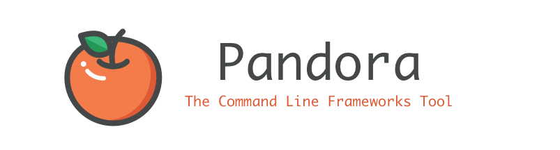
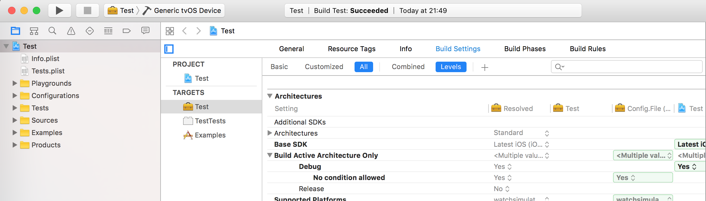

[](https://travis-ci.org/frameworkoriented/pandora)
[](https://coveralls.io/github/frameworkoriented/pandora)
[](https://badge.fury.io/rb/pandora-frameworks)
[](http://www.rubydoc.info/github/framework-oriented/pandora/master)

Pandora is a command line tool written in Ruby thought to make working with Frameworks easier.
If you haven't heard about it before, we recommend you to check out [frameworkoriented.io](frameworkoriented.io)

## Installation

Add this line to your application's Gemfile:

```ruby
gem 'pandora-frameworks'
```

And then execute:

    $ bundle

Or install it yourself as:

    $ gem install pandora-frameworks

## Usage

### Creating a framework

You can easily create a framework with the create command. It creates a framework project that includes an example project and an example playground:

```bash
pandora create NAME
```



## Development

After checking out the repo, run `bin/setup` to install dependencies. Then, run `rake spec` to run the tests. You can also run `bin/console` for an interactive prompt that will allow you to experiment.

To install this gem onto your local machine, run `bundle exec rake install`. To release a new version, update the version number in `version.rb`, and then run `bundle exec rake release`, which will create a git tag for the version, push git commits and tags, and push the `.gem` file to [rubygems.org](https://rubygems.org).

## Contributing

Bug reports and pull requests are welcome on GitHub at https://github.com/frameworkoriented/pandora. This project is intended to be a safe, welcoming space for collaboration, and contributors are expected to adhere to the [Contributor Covenant](http://contributor-covenant.org) code of conduct.


## License

The gem is available as open source under the terms of the [MIT License](http://opensource.org/licenses/MIT).

